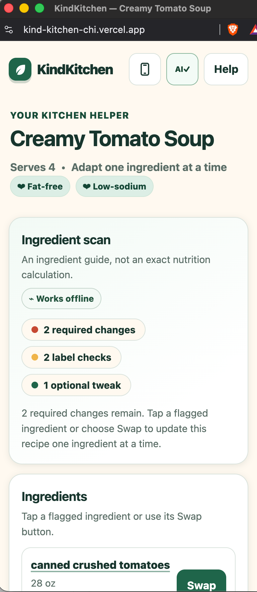
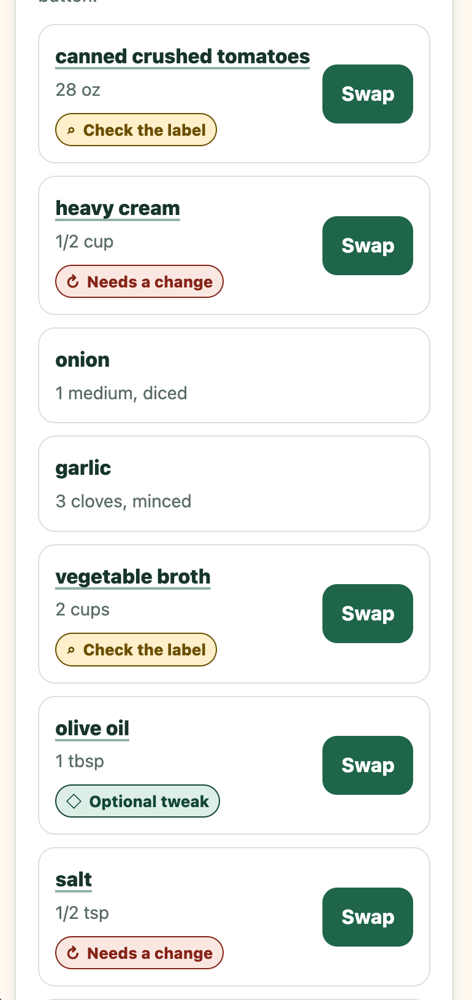
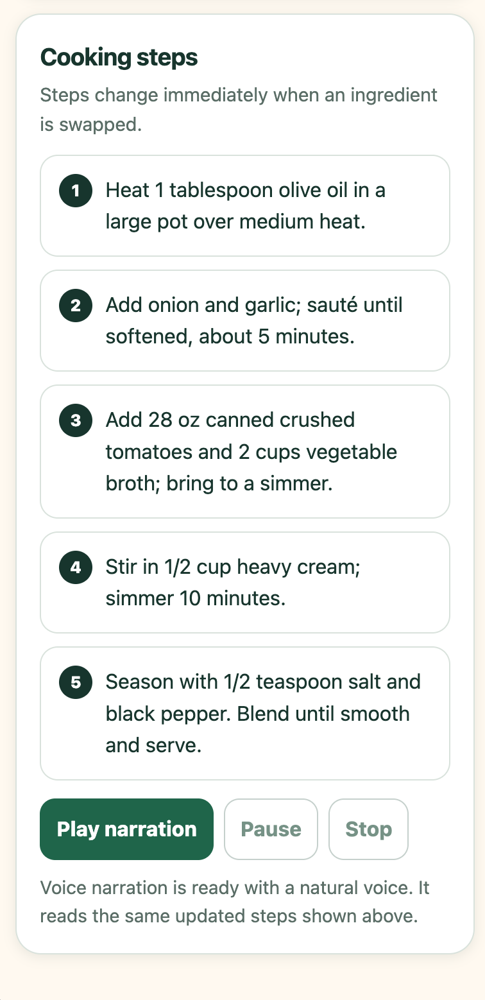

# KindKitchen

**Live demo:** https://kind-kitchen-chi.vercel.app/

An offline-first recipe-adaptation demo for fat-free and low-sodium preferences. Swap flagged ingredients one at a time and the cooking steps update instantly, with optional AI-assisted swap selection and voice narration.

## Screenshots

| Recipe & ingredient scan | Ingredient swaps | Cooking steps & narration |
| --- | --- | --- |
|  |  |  |

### Section A — Architecture Decisions

KindKitchen is intentionally a single `demo.html` with inline CSS and JavaScript, so the assessment path works offline without an account, backend, build step, or downloaded assets. The cream-and-forest-green interface is phone-first, and recipe data, dietary findings, approved swaps, current substitutions, rewritten steps, and narration position are managed as one client-side state model. That shared state makes the visible recipe and spoken narration agree after every swap. A small Node service is optional: it can ask OpenAI to select an approved substitution and can generate natural TTS audio for a recipe step.

I chose a constrained LLM selector over free-form LLM generation because the model returns only one approved substitution ID. It cannot invent an ingredient, amount, nutrition claim, medical advice, cooking instruction, or parent-facing wording. For “Another option,” the client sends previously seen IDs and the server limits the model to the remaining authored options; the browser validates the result and renders the catalog copy itself. I chose a deterministic local catalog on both client and server over a remote catalog service because the demo must work immediately with no network. The trade-off is duplicated data, which production would replace with one governed source of truth.

I chose OpenAI TTS with browser SpeechSynthesis fallback over TTS-only narration because cooking must remain usable when the service, network, audio request, or browser playback fails. Audio is cached by step text, so only a changed step is re-fetched after a swap and the listener keeps their place. Before scaling, I would validate the approved swap catalog and wording with qualified clinical nutrition and food-service stakeholders; this proof of concept is not clinical nutrition advice.

### Section B — Production Readiness Considerations

* **Clinical content governance — Blocks hospital deployment.** A dietitian- and food-service-reviewed catalog needs named owners, versioning, review dates, source rationale, and a formal process for approving or withdrawing a swap. “Low-sodium” and “fat-free” policies must be defined by the hospital rather than inferred by the application.
* **Privacy, security, and vendor review — Blocks hospital deployment.** Preserve the current no-PHI request contract, but add a threat model, egress controls, secret management, TLS, dependency scanning, audit logging that excludes recipe text where unnecessary, and formal approval of the OpenAI data-flow and any hosting provider.
* **Accessible usability validation — Blocks hospital deployment.** Test the 320px–390px flow with parents, screen-reader users, keyboard-only users, text enlargement, reduced motion, and common mobile browsers. Fix issues against the hospital’s accessibility standard before launch.
* **Reliable service operations — Later-sprint improvement after the offline path is proven.** Add health monitoring, dashboards, structured non-sensitive error metrics, request rate limits, circuit breakers, TTS/LLM cost controls, and synthetic checks. The deterministic frontend must continue to be the safe operating mode during outages.
* **Content management and release controls — Later-sprint improvement.** Move the duplicated approved catalog into a versioned, reviewed source with automated client/server consistency tests, staged releases, rollback, and a way to publish new recipes without editing application code.

### Section C — AI Usage Log (Mandatory)

1. **Interaction: safety architecture for substitutions.** I asked an AI assistant to help design an LLM integration that could improve a swap without making the experience dependent on a model response. It suggested a timeout-backed fallback pattern. I kept the bounded-failure approach, but changed the model from a text generator into an ID-only selector so all amounts, explanations, and cooking notes remain authored and validated.

2. **Interaction: mobile interaction and narration behavior.** I asked for help reasoning through a single source of truth for ingredient changes, cooking steps, and step-by-step narration, including swaps made during playback. It proposed rebuilding narration after state changes. I kept that principle and applied it to both TTS audio and browser SpeechSynthesis, while rejecting any design that restarts the user at step one or requires narration for the core task.

3. **Interaction: implementation review and refinement.** I used AI to review edge cases around offline use, option rotation, focus feedback, and small-screen layout. It surfaced the risk that re-clicking a swapped ingredient could repeatedly show the same option. I kept the “Another option” rotation with seen-option tracking, but rejected exposing the internal approved-choice catalog to parents; the interface shows one clear recommendation at a time.
